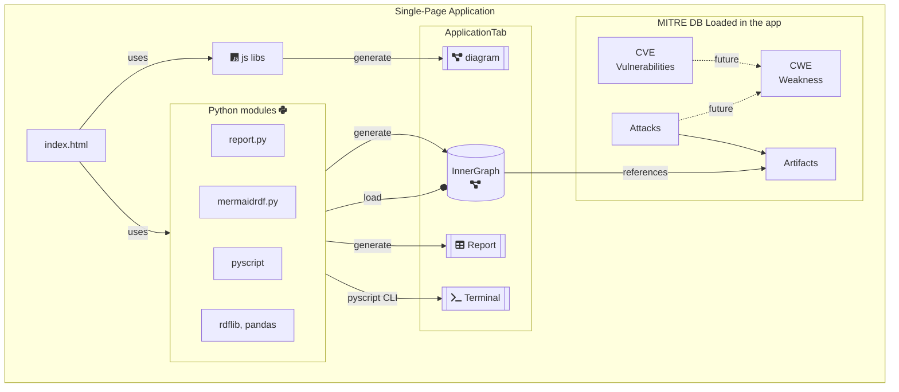

# Neo4j + D3FEND

In this repo you can find an ongoing experiment of using D3FEND for design analysis on
kubernetes / openshift deployment files and on mermaidjs diagrams.

This is not for production :)

- The [MermaidJS -> D3FEND is on github pages](https://par-tec.github.io/neo4j-semantic-docker/mermaid/)

The steps are the following:

1. transform the Kubernetes manifests into RDF;
2. load the RDF into the Neo4j instance you find in docker-compose.

## Running

This repo creates an RDF representation of a Kube deployment.

```bash
tox -e kube-to-rdf -- ${MANIFEST_DIR} ${DEST_FILE}
ls -la ${DEST_FILE}.ttl
```

Now import the RDF into Neo4j.

```bash
docker-compose up -d neo4j
```

Access the neo4j container and run  via the CLI

```bash
docker-compose exec neo4j bash
$ cd /code
$ cypher-shell -u neo4j  -f /code/neo4j.init --fail-at-end <<< ""
```

Query the graph

```cypher
MATCH
        (n) -- (p:ns0__Kind)  // all nodes connected with a k8s resource
WHERE
        NOT n:ns0__Namespace
RETURN n
```

Show entities

```cypher
match (p) -- (n:ns0__Kind)
where
        p.rdfs__label is null
        or not p.rdfs__label = "ndc-dev"
return p
```

Show access patterns

```cypher
match (n:ns0__Kind) -- (p) <-[:ns0__accesses*]- (q)
where not p:ns0__Namespace
return q
```

### Complex queries

To identify attack patterns in relation with a specific infrastructure,
you can query for existing paths (p) connecting:

- *instances* that are k8s Kinds (e.g. persistent volumes, images, ...)
  which are subclasses of d3f *artifact*s
- *attack*s that affect the above *artifact*s

```cypher
MATCH
    p=(instance) -[:rdf__type]-> ( :k8s__Kind)
           -[:rdfs__subClassOf*]->
           (artifact)
           <-[relation]- (attack:d3f__OffensiveTechnique)

return p
```

## pre-commit

Pre-commit checks your files before committing. It can lint, format or do
other checks on them.

Once you install it via

```bash
pip3 install pre-commit --user
```

You can run it directly via

```bash
pre-commit run --all-files
```

Or install it as a pre-commit hook

```bash
pre-commit install
```

## Webapp Diagram


