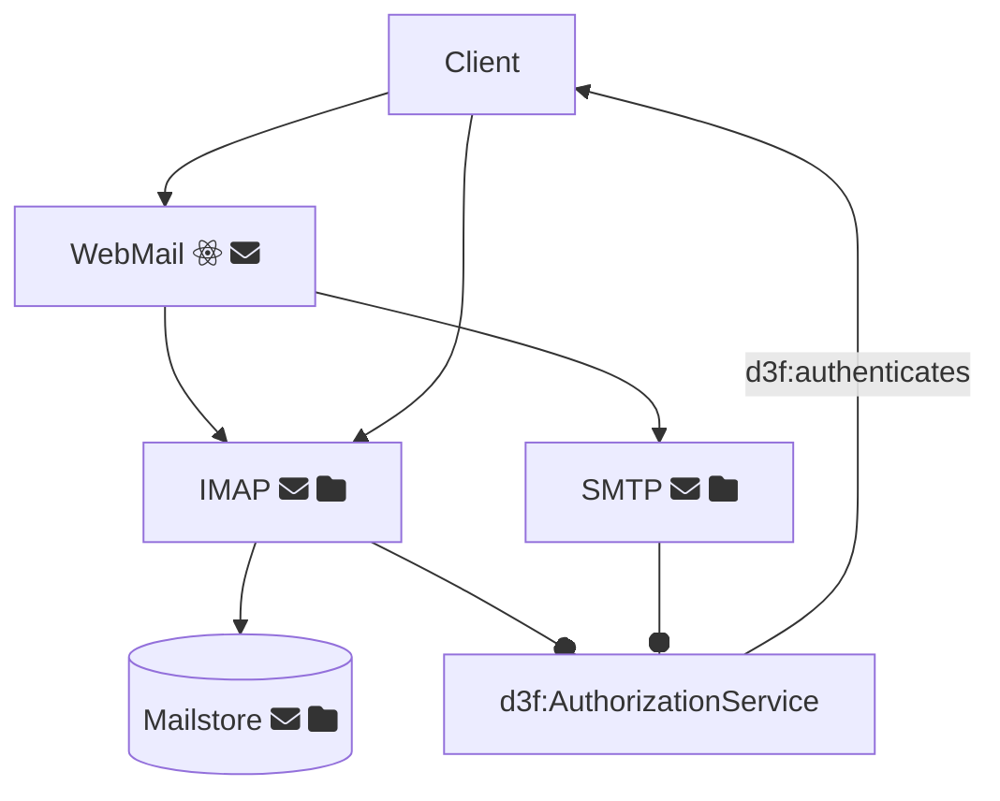

## Associate nodes to DigitalArtifacts

```cypher
MATCH p=
  (instance:ns0__Node)-[:rdfs__type*]-> (instance_type) -[:rdfs__subClassOf]-> (artifact:d3f__DigitalArtifact)
RETURN p LIMIT 2000
```


## Principal attacks to a mail infrastructure

1. mermaid -> RDF
2. import RDF in neo4j
3. label  nodes (aka indexing)
4. querying

```cypher

MATCH p=
  (i:ns0__Node)-[:rdfs__subClassOf]->
  (artifact:d3f__DigitalArtifact)
  <-[relation]- (attack:d3f__OffensiveTechnique)
RETURN p LIMIT 2000
```

## Diagram


