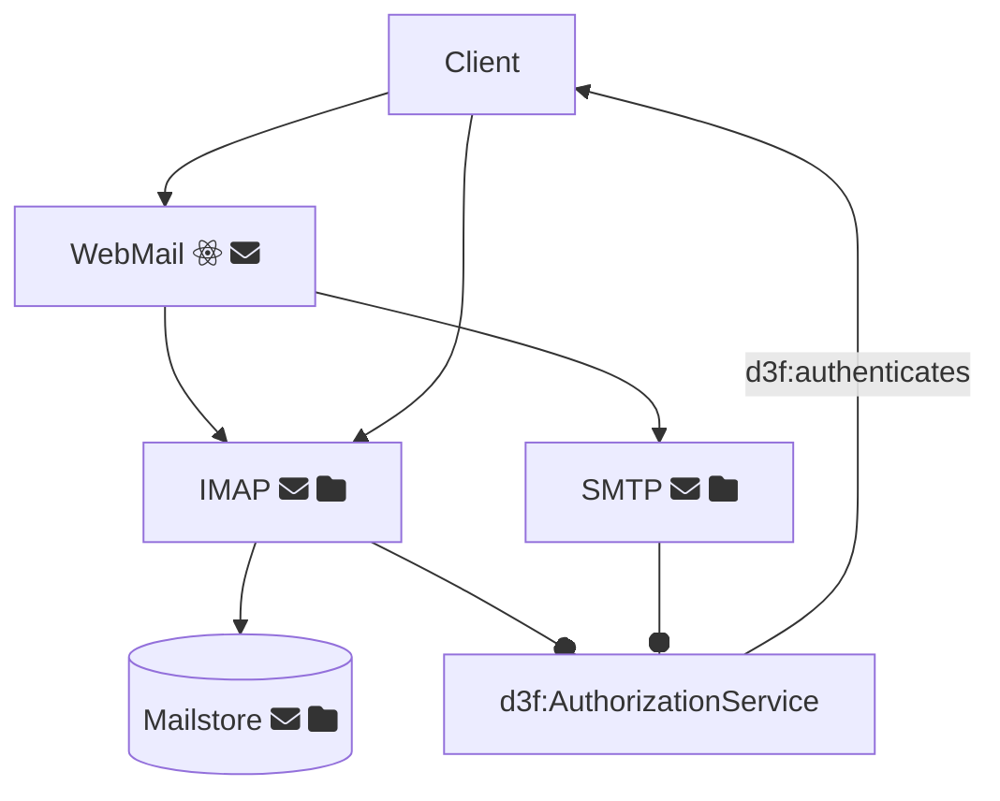
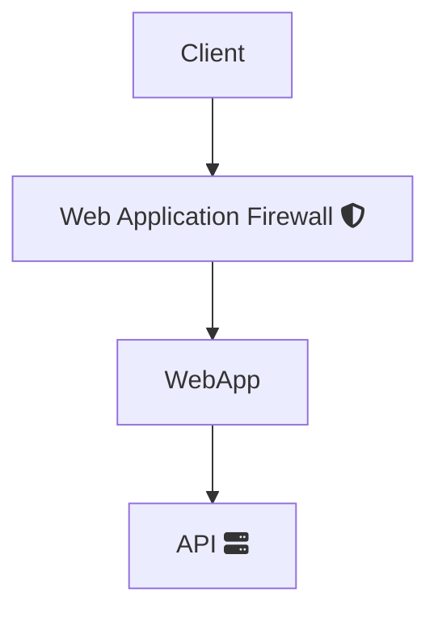

## Associate nodes to DigitalArtifacts

```cypher
MATCH p=
  (instance:ns0__Node)-[:rdfs__type*]-> (instance_type) -[:rdfs__subClassOf]-> (artifact:d3f__DigitalArtifact)
RETURN p LIMIT 2000
```

## Principal attacks to a mail infrastructure

1. mermaid -> RDF
2. import RDF in neo4j
3. label  nodes (aka indexing)
4. querying

```cypher

MATCH p=
  (i:ns0__Node)-[:rdfs__subClassOf]->
  (artifact:d3f__DigitalArtifact)
  <-[relation]- (attack:d3f__OffensiveTechnique)
RETURN p LIMIT 2000
```

1. Associate each node with its rdf:type (which is a d3f:DitigalArtifact):

```cypher
(n:ns0__Node)-[:rdf__type]->(artifact:d3f__DigitalArtifact)
```

1. then follow the DigitalArtifact hierarchy to the least-specific type
   with various level of `subClassOf` indirection (0..3)

```cypher
(artifact:d3f__DigitalArtifact)
-[:rdfs__subClassOf*0..3]->  // 0..3 levels of indirection.
(vulnerableArtifact:d3f__DigitalArtifact)
```

1. then find the attack that compromises it

```cypher
(vulnerableArtifact:d3f__DigitalArtifact)
<-[compromises]-(attack:d3f__OffensiveTechnique)
```

The complete query is

```cypher
MATCH p=
 (n:ns0__Node)-[:rdf__type]->
 (artifact:d3f__DigitalArtifact) -[:rdfs__subClassOf*0..3]->
 (vulnerableArtifact:d3f__DigitalArtifact)
  <-[compromises]-(attack:d3f__OffensiveTechnique)
RETURN p
```

1. To identify DigitalArtifacts associated to specific nodes,
   we can replace the `:rdf__type` relation with a generic one

```cypher
MATCH p=
 (n:ns0__Node) -->
 (artifact:d3f__DigitalArtifact) -[:rdfs__subClassOf*0..3]->
 (vulnerableArtifact:d3f__DigitalArtifact)
  <-[compromises]-(attack:d3f__OffensiveTechnique)
RETURN p
```

## Diagram 1



## Diagram 2


